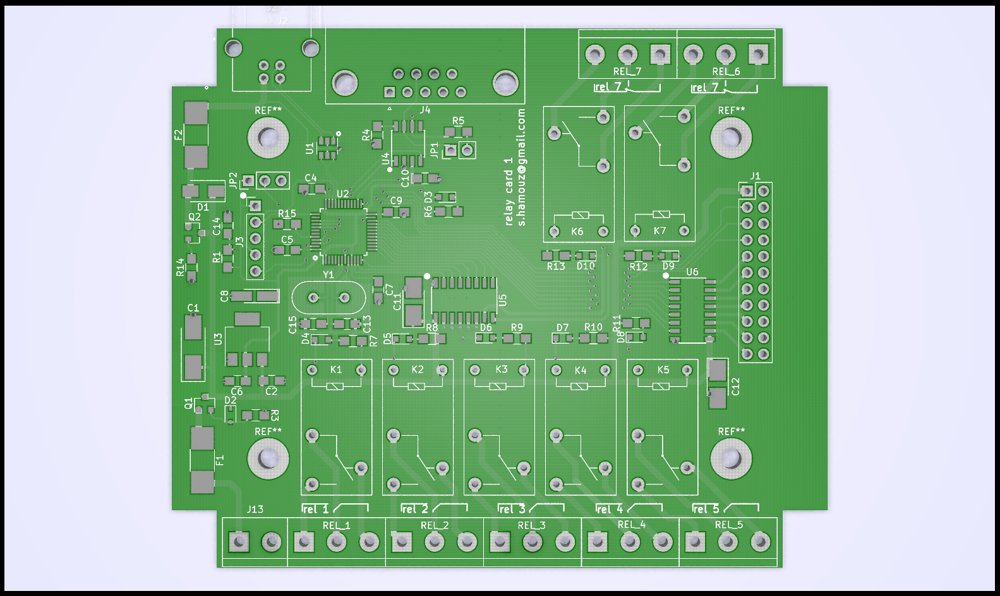
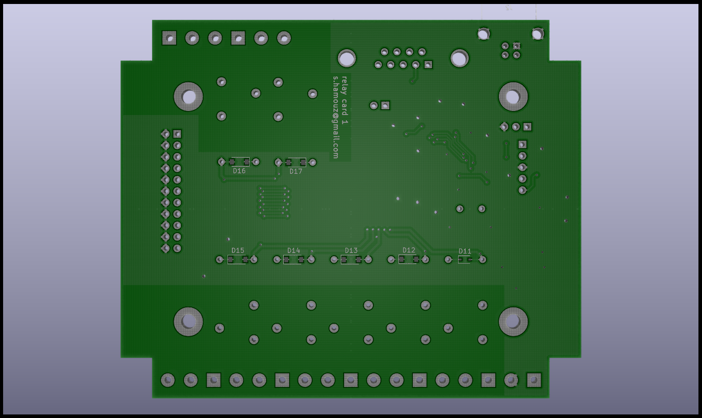

#  Board-for-Relay-Card
This repository contains design of schematic and PCB for Relay Card. 
**This board support**:
- up to 7 relays (with SPDT contacts)
- additional 7 relays on extra board
- control of relay over USB
- control of relay over CAN
- single power supply from USB
- possibility of external power supply (for board control over CAN)

This is based on STM32 microcontroller F0 family (STM32F072C8T6). This microcontroller supports USB and in advance it support crystal-less USB. The CAN driver is also available. 

The goal is use as less parts as possible with consideration of hand soldering. All the part should be simple to get or replace with another compatible. The design is simple two layer board with most of the parts (and all necessary) on top layer. The design fits to box for DIN lath.

This is related to these repositories:
[Firmware-for-Relay-Card](https://github.com/chapppy/Firmware-for-Relay-Card "Firmware-for-Relay-Card") 
[Sample-GUI-for-Relay-Card](https://github.com/chapppy/Sample-GUI-for-Relay-Card "Sample-GUI-for-Relay-Card")
[Board-for-Relay-Card](https://github.com/chapppy/Board-for-Relay-Card "Board-for-Relay-Card")

## schematic
[full schematic](https://github.com/chapppy/Board-for-Relay-Card/blob/master/export/schematic-full.pdf "full schematic")

In case of control only over USB and 4 relays, there is reduced schematic:
[reduced schematic](https://github.com/chapppy/Board-for-Relay-Card/blob/master/export/schematic-USB-4-rleays.pdf "reduced schematic")

## PCB design

## data for manufacturing
[manufacturing data](https://github.com/chapppy/Board-for-Relay-Card/blob/master/export/manufacturing.zip "manufacturing data")
